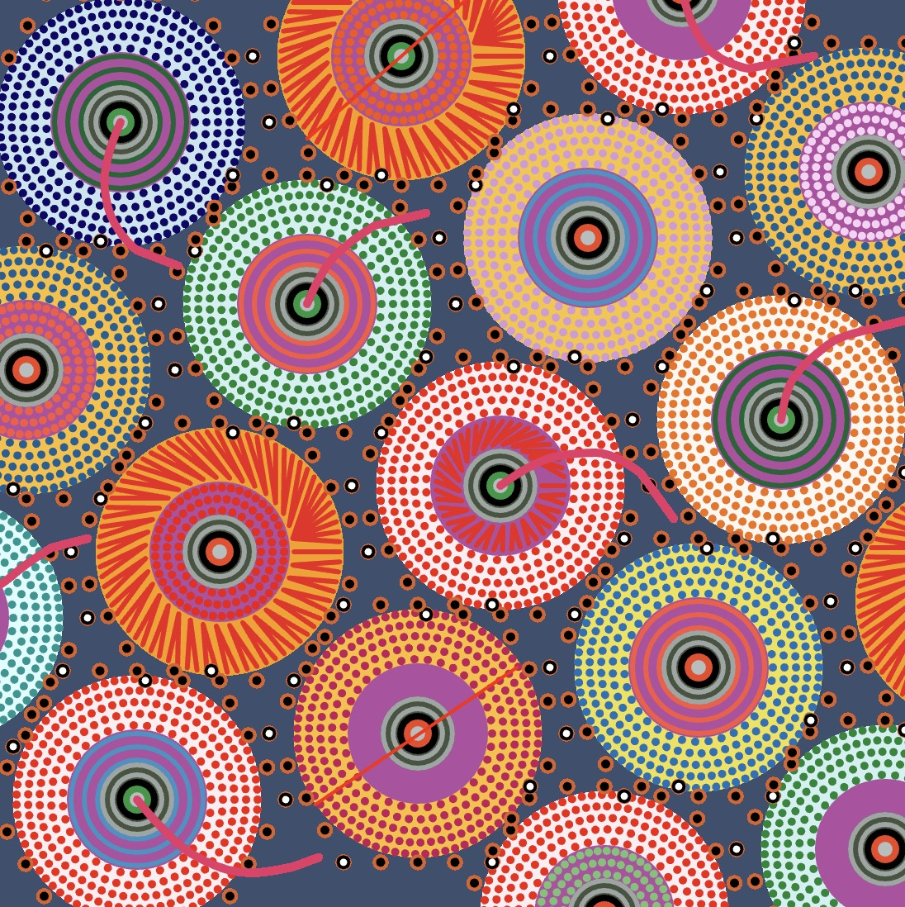
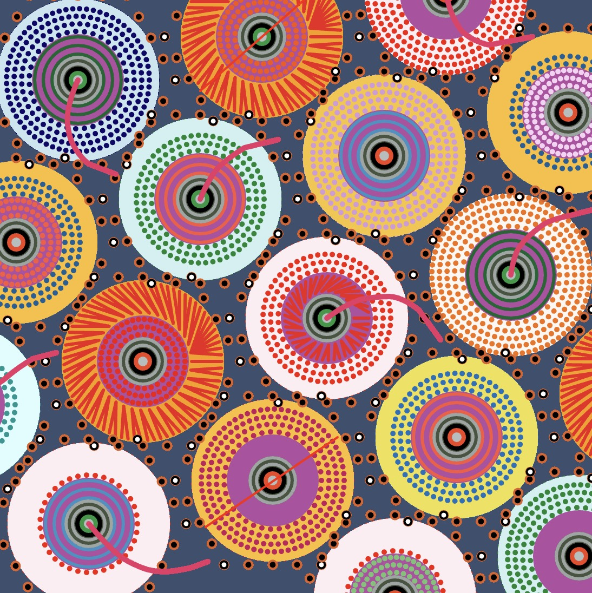
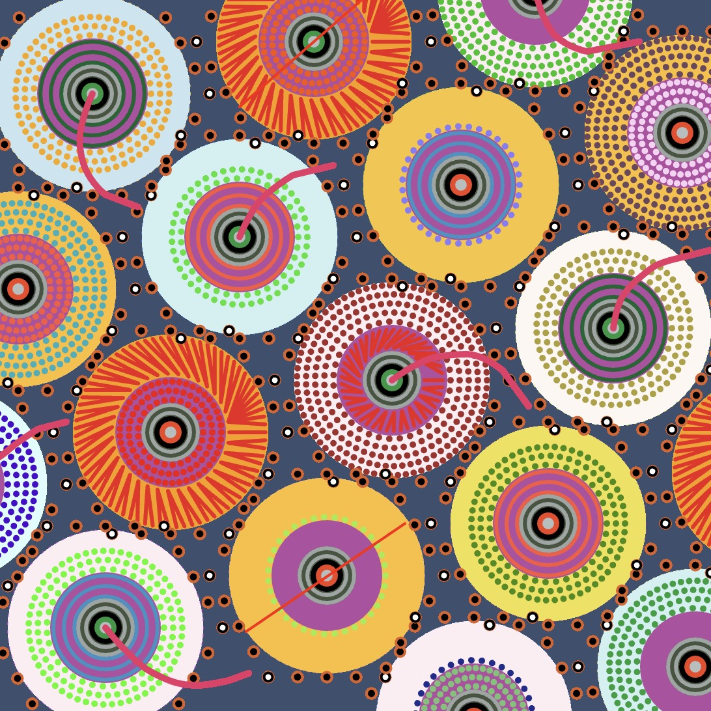
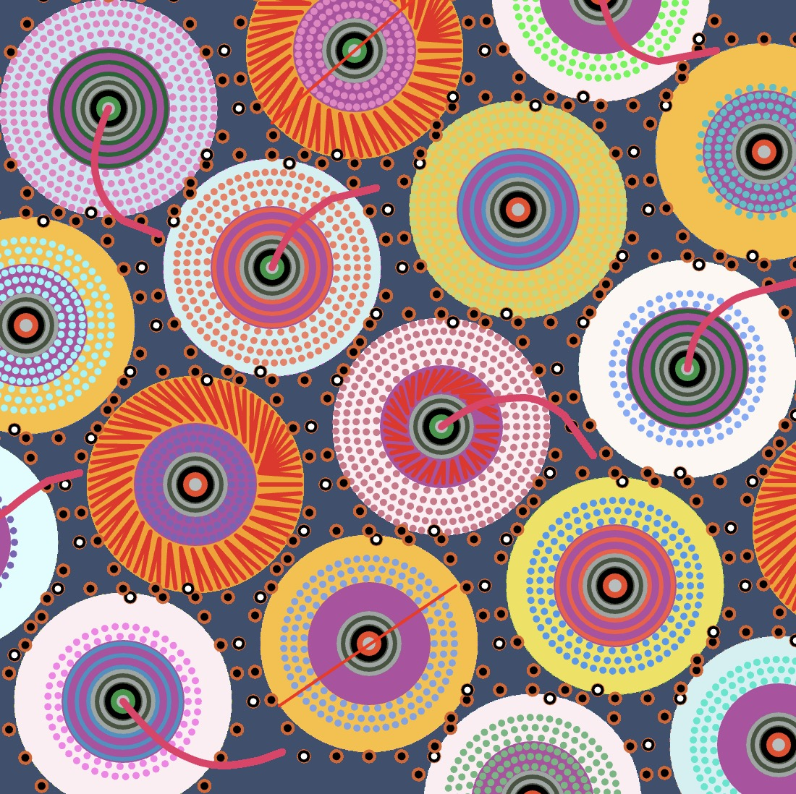
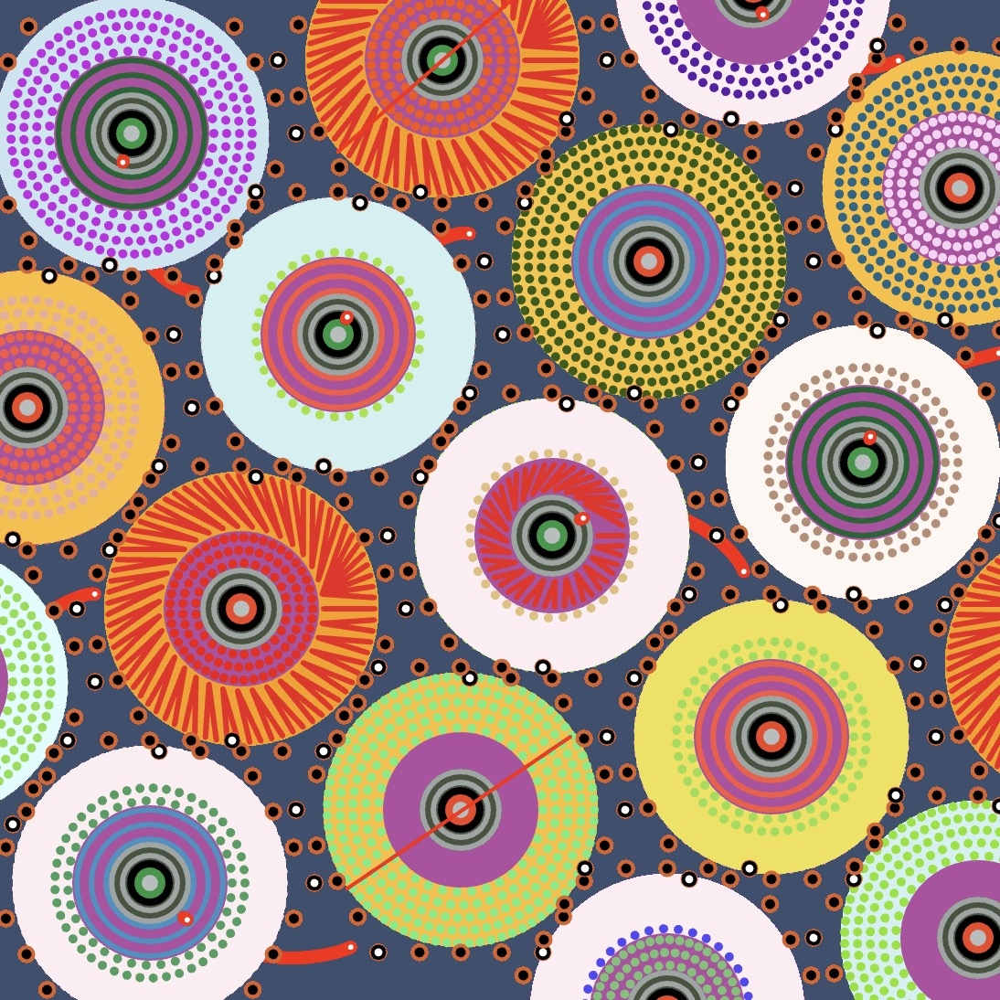
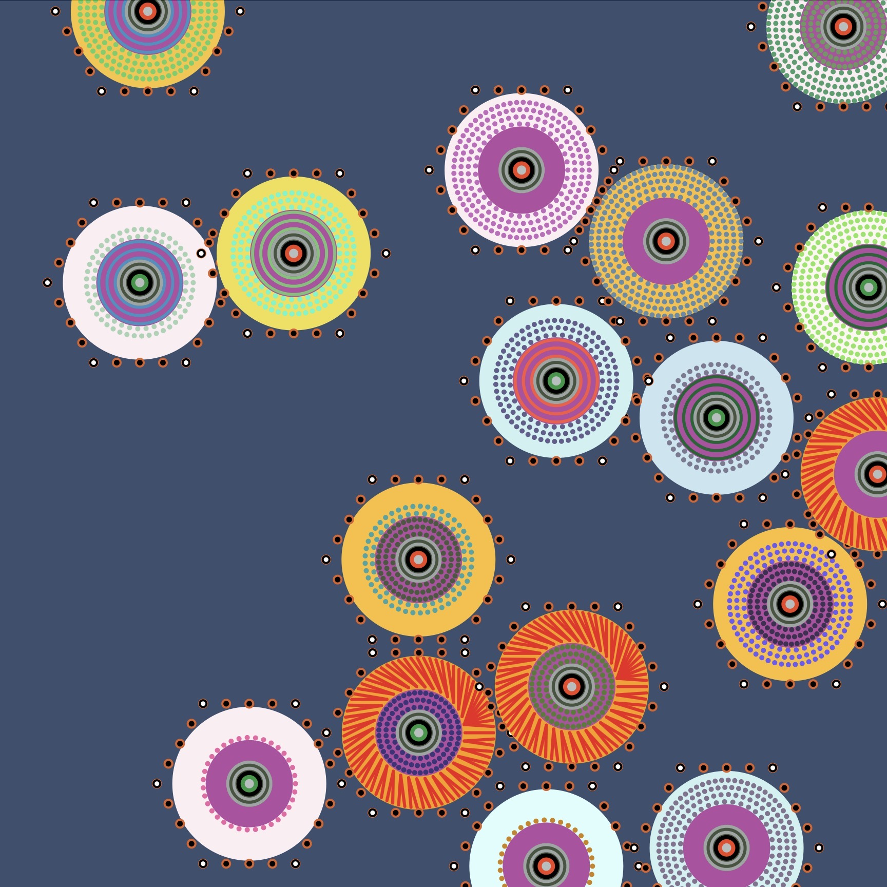

Random Seed (Perlin Noise)

- Inspiration

In our group project, we selected Pacita Abad's "Wheels of Fortune" as the inspiration for our creative endeavor. The group project performed exceptionally well, achieving a near-perfect replication of this renowned artwork. In my individual assignment, I created animations building upon the group's code by utilizing random and Perlin noise functions.

- Iteration

  - iteration 1
  Modified the quantity of dots using the random function.
  

  - iteration 2
  Adjusted dot colors using the random function.
  
  
  - iteration 3
  Applied the Perlin noise function to the colors of middle dots.
  

  - iteration 4
  Drawing inspiration from the curve trail effect in the week9 tutorial, I attempted a similar modification to the pink curve. While successfully achieving this effect in the curve's code (as shown in image 1), the application to the main code required clearing the canvas to create the trail effect (as in image 2), making it impossible to leave a trail above other opaque shapes. Consequently, this effect was ultimately removed.
  
  

  - iteration 5
  Referencing the random position code from the seventh-week lecture, I changed positions to random locations and added an effect of objects falling from the screen.
  

  - iteration 6
  Lastly, I removed unused code to enhance overall efficiency.

- Final Animation effects
  

- Summary
In summary, in my individual assignment, I explored numerous animation ideas and made several attempts, although not all ideas were fully realized. The final presentation of the work still has room for improvement.